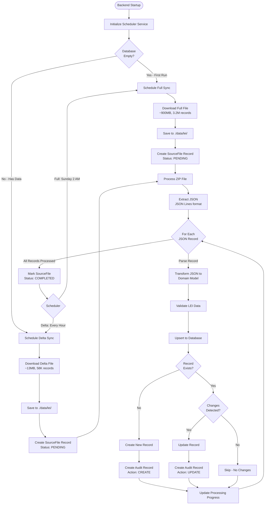
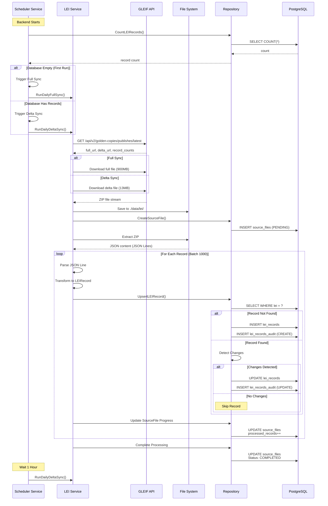
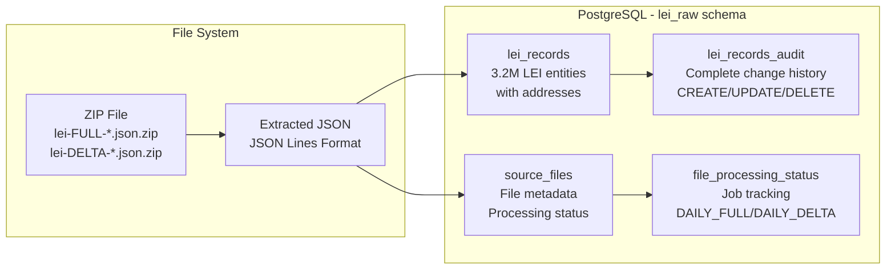
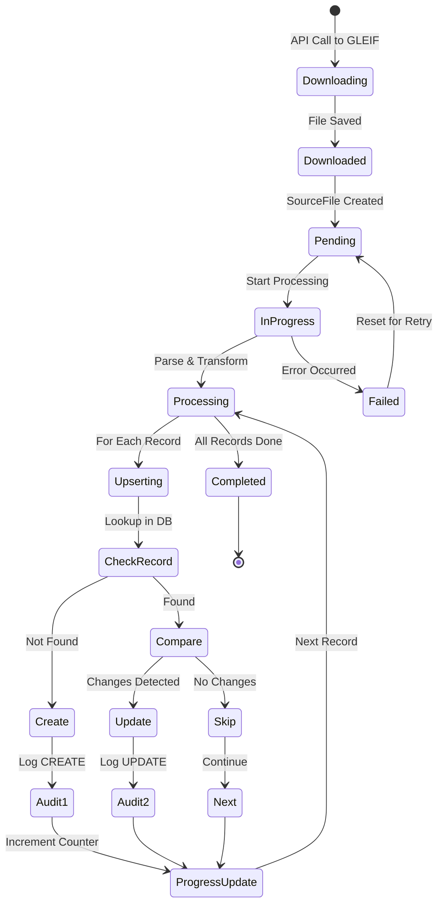
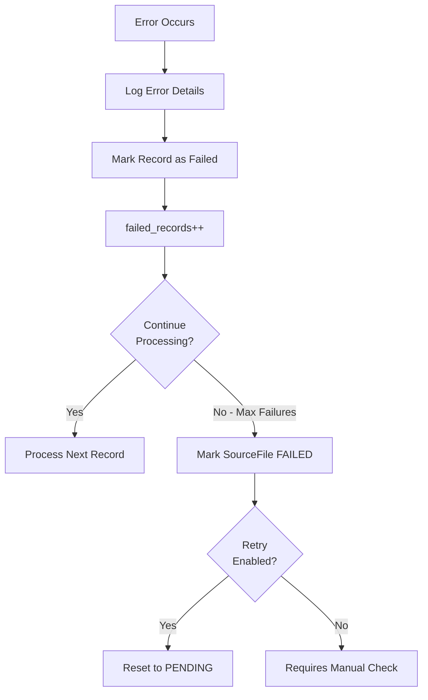

# LEI Data Acquisition Flow

This document visualizes the complete flow of LEI (Legal Entity Identifier) data acquisition,
from scheduling through to storage.

## High-Level Flow Diagram



## Detailed Component Interaction



## Data Storage Structure



## Processing States



## Directory Structure

```text
./data/lei/
├── lei-FULL-20260211-132723.json.zip    # Full snapshot (900MB)
├── lei-DELTA-20260211-080000.json.zip   # Delta updates (13MB)
└── extracted/
    ├── lei-FULL-20260211-132723.json    # Extracted JSON Lines
    └── lei-DELTA-20260211-080000.json   # Extracted JSON Lines
```

## Key Features

### 1. Smart First Run Detection

- On first startup with empty database: Downloads **full file** (3.2M records)
- On subsequent runs: Downloads **delta files** (incremental updates only)

### 2. Change Detection

- Compares incoming record with existing database record
- Only updates if actual field changes are detected
- Skips unchanged records to reduce database load

### 3. Complete Audit Trail

- Every CREATE/UPDATE/DELETE logged in `lei_records_audit`
- Includes full record snapshot before and after
- Tracks which source file triggered the change

### 4. Resume Capability

- Tracks `last_processed_lei` in source file
- Can resume from any LEI code if processing is interrupted
- No duplicate processing on resume

### 5. Progress Tracking

- Real-time counters: `processed_records`, `failed_records`
- Progress logs every 1,000 records
- Status visible via API: `/api/v1/lei/status/:jobType`

## Schedule Configuration

All schedules are configurable via environment variables. Defaults shown below:

| Job Type           | Frequency         | Environment Variable      | Default Value |
|--------------------|-------------------|---------------------------|---------------|
| Delta Sync         | Every 1 hour      | `LEI_DELTA_SYNC_INTERVAL` | `1h`          |
| Full Sync          | Weekly (Sunday)   | `LEI_FULL_SYNC_DAY`       | `Sunday`      |
| Full Sync Time     | 2:00 AM           | `LEI_FULL_SYNC_TIME`      | `02:00`       |
| File Cleanup       | 3:00 AM daily     | `LEI_CLEANUP_TIME`        | `03:00`       |
| Retain Full Files  | Last 2 files      | `LEI_KEEP_FULL_FILES`     | `2`           |
| Retain Delta Files | Last 5 files      | `LEI_KEEP_DELTA_FILES`    | `5`           |

**Note:** Invalid values fall back to defaults.
See [LEI_ACQUISITION.md](LEI_ACQUISITION.md#environment-variables) for detailed format specifications.

## Performance Metrics

| Operation           | Throughput                | Notes                                        |
| ------------------- | ------------------------- | -------------------------------------------- |
| Download Full File  | ~54 seconds               | 900MB over network                           |
| Download Delta File | ~5 seconds                | 13MB over network                            |
| Process Records     | ~1,000 records/10 sec     | Includes parsing, transform, upsert          |
| Database Insert     | ~100 records/sec          | With audit trail creation                    |

## Error Handling



## Monitoring & Observability

### Logs

- Structured JSON logs with zerolog
- Progress updates every 1,000 records
- Error logs with full context

### Metrics (Available via API)

- `/api/v1/lei` - List LEI records
- `/api/v1/lei/:lei` - Get specific LEI
- `/api/v1/lei/:lei/audit` - View change history
- `/api/v1/lei/status/:jobType` - Check job status

### Database Queries

```sql
-- Check processing status
SELECT file_name, processing_status, 
       processed_records, failed_records, total_records
FROM lei_raw.source_files
ORDER BY downloaded_at DESC;

-- View recent changes
SELECT lei, action, created_at
FROM lei_raw.lei_records_audit
ORDER BY created_at DESC
LIMIT 10;

-- Count total records
SELECT COUNT(*) FROM lei_raw.lei_records;
```
