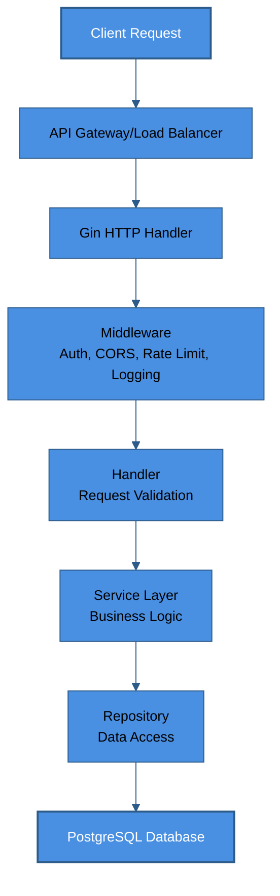
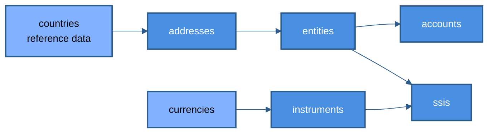
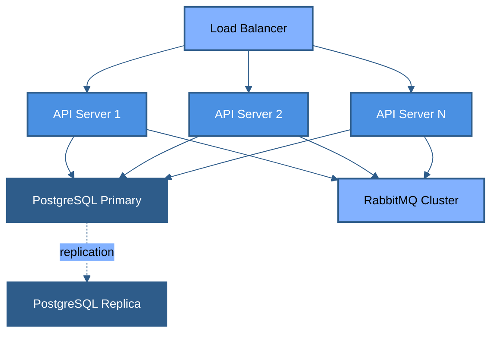

# Architecture Overview

## System Design

Axiom is built as a modular monolith with clear boundaries between different domains:

### Layers

1. **Presentation Layer (API)**
   - REST API endpoints using Gin framework
   - JWT authentication
   - CORS configuration
   - Rate limiting
   - Input validation

2. **Application Layer (Handlers & Services)**
   - HTTP handlers for request/response handling
   - Business logic services
   - Command/Query separation (CQRS)
   - Transaction management

3. **Domain Layer (Models)**
   - Core business entities
   - Domain logic
   - Type definitions
   - Enum constants

4. **Infrastructure Layer (Repository & External Services)**
   - Database access using GORM
   - RabbitMQ integration
   - External API clients
   - Caching layer (PostgreSQL)

### Data Flow

### CQRS Pattern

The system separates read and write operations:

#### Commands (Write Operations)

- Create, Update, Delete operations
- Business rule validation
- Event publishing to RabbitMQ
- Audit log generation

#### Queries (Read Operations)

- Optimized read models
- Caching layer
- Pagination support
- Filtering and sorting

### Database Schema

### Microservices Communication

While deployed as a monolith, internal services communicate through:

- Direct function calls (in-process)
- Event bus (RabbitMQ) for async operations
- Shared database (with schema separation)

### Scalability

- **Horizontal Scaling**: Stateless API servers behind load balancer
- **Database Scaling**: Read replicas, connection pooling
- **Caching**: PostgreSQL for frequently accessed data
- **Message Queue**: RabbitMQ for async processing

### Security

- JWT-based authentication
- HTTPS/TLS encryption
- SQL injection prevention (ORM)
- Input validation
- Rate limiting
- CORS configuration
- Audit logging

## Deployment Architecture

## Future Considerations

- Service extraction: If a module grows too large, it can be extracted as a microservice
- Event sourcing: For complete audit trail
- GraphQL: Alternative API interface
- Multi-tenancy: Data isolation per client
