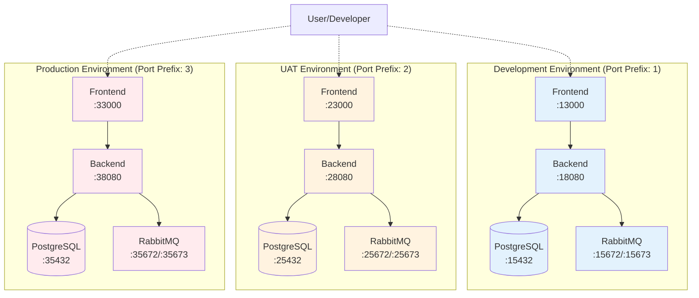

# Multi-Environment Docker Setup

This document describes the multi-environment Docker setup for Axiom, which allows running development, UAT, and
production environments simultaneously on the same machine.

## Overview

The Axiom project supports three independent environments, each with its own:
- Database instance (PostgreSQL)
- Message queue (RabbitMQ)
- Backend service
- Frontend service
- Network namespace
- Data volumes

This enables side-by-side comparison and testing across environments without conflicts.

## Architecture Diagram



## Port Assignment Strategy

Each environment uses a unique port prefix to avoid conflicts:

### Development Environment (Prefix: 1)
| Service | Internal Port | External Port |
|---------|--------------|---------------|
| Frontend | 3000 | 13000 |
| Backend API | 8080 | 18080 |
| PostgreSQL | 5432 | 15432 |
| RabbitMQ AMQP | 5672 | 15672 |
| RabbitMQ Management | 15672 | 15673 |

### UAT Environment (Prefix: 2)
| Service | Internal Port | External Port |
|---------|--------------|---------------|
| Frontend | 3000 | 23000 |
| Backend API | 8080 | 28080 |
| PostgreSQL | 5432 | 25432 |
| RabbitMQ AMQP | 5672 | 25672 |
| RabbitMQ Management | 15672 | 25673 |

### Production Environment (Prefix: 3)
| Service | Internal Port | External Port |
|---------|--------------|---------------|
| Frontend | 3000 | 33000 |
| Backend API | 8080 | 38080 |
| PostgreSQL | 5432 | 35432 |
| RabbitMQ AMQP | 5672 | 35672 |
| RabbitMQ Management | 15672 | 35673 |

## Environment Configuration Files

Each environment has its own configuration file:

- `.env.dev` - Development environment variables
- `.env.uat` - UAT environment variables
- `.env.prod` - Production environment variables

### Configuration Variables

Each `.env` file contains:

```bash
# Project identification
COMPOSE_PROJECT_NAME=axiom-{env}
ENVIRONMENT={env}

# Port mappings
POSTGRES_PORT={prefix}5432
RABBITMQ_PORT={prefix}5672
RABBITMQ_MGMT_PORT={prefix}15672
BACKEND_PORT={prefix}8080
FRONTEND_PORT={prefix}3000

# Database credentials
POSTGRES_USER=axiom
POSTGRES_PASSWORD=axiom_{env}_pass
POSTGRES_DB=axiom_{env}

# Application configuration
JWT_SECRET={env}-secret-change-in-production
SERVER_MODE=debug|release
```

## Docker Compose Files

Each environment has a dedicated Docker Compose file:

- `docker-compose.dev.yml` - Development environment
- `docker-compose.uat.yml` - UAT environment
- `docker-compose.prod.yml` - Production environment

These files:
- Reference environment variables from corresponding `.env` files
- Create isolated Docker networks
- Use separate volume names for data persistence
- Configure service dependencies and health checks

## Usage

### Starting Environments

```bash
# Start individual environment
make docker-dev-up     # Development
make docker-uat-up     # UAT
make docker-prod-up    # Production

# Start all environments at once
make docker-all-up
```

### Stopping Environments

```bash
# Stop individual environment
make docker-dev-down   # Development
make docker-uat-down   # UAT
make docker-prod-down  # Production

# Stop all environments
make docker-all-down
```

### Viewing Logs

```bash
# View logs for specific environment
make docker-dev-logs   # Development
make docker-uat-logs   # UAT
make docker-prod-logs  # Production
```

### Checking Status

```bash
# View status of all environments
make docker-all-status
```

### Restarting Services

```bash
# Restart specific environment
make docker-dev-restart
make docker-uat-restart
make docker-prod-restart
```

## Database Migrations

Each environment has its own database, requiring separate migration management:

```bash
# Run migrations
make migrate-dev-up    # Development database
make migrate-uat-up    # UAT database
make migrate-prod-up   # Production database

# Rollback migrations
make migrate-dev-down  # Development database
make migrate-uat-down  # UAT database
make migrate-prod-down # Production database
```

## Accessing Services

### Frontend Applications

- Development: http://localhost:13000
- UAT: http://localhost:23000
- Production: http://localhost:33000

### Backend APIs

- Development: http://localhost:18080
- UAT: http://localhost:28080
- Production: http://localhost:38080

### Swagger Documentation

- Development: http://localhost:18080/swagger/index.html
- UAT: http://localhost:28080/swagger/index.html
- Production: http://localhost:38080/swagger/index.html

### Database Connections

```bash
# Development
psql -h localhost -p 15432 -U axiom -d axiom_dev

# UAT
psql -h localhost -p 25432 -U axiom -d axiom_uat

# Production
psql -h localhost -p 35432 -U axiom -d axiom_prod
```

### RabbitMQ Management UI

- Development: http://localhost:15673 (guest/guest)
- UAT: http://localhost:25673 (guest/guest)
- Production: http://localhost:35673 (guest/guest)

## Container Naming

Containers follow this naming pattern: `axiom-{env}-{service}`

Examples:
- `axiom-dev-backend`
- `axiom-uat-postgres`
- `axiom-prod-frontend`

## Network Isolation

Each environment runs in its own Docker network:
- `axiom-dev-network`
- `axiom-uat-network`
- `axiom-prod-network`

This ensures complete isolation between environments.

## Volume Management

Data volumes are environment-specific:
- `postgres_data_dev`
- `postgres_data_uat`
- `postgres_data_prod`

This allows each environment to maintain its own persistent data.

## Common Use Cases

### Testing a Feature Across Environments

```bash
# Start all environments
make docker-all-up

# Deploy feature to dev
# ... build and deploy ...

# Test in dev: http://localhost:13000

# Promote to UAT
# ... build and deploy ...

# Test in UAT: http://localhost:23000

# Compare side-by-side
# Dev: http://localhost:13000
# UAT: http://localhost:23000
```

### Database Comparison

```bash
# Connect to dev database
psql -h localhost -p 15432 -U axiom -d axiom_dev

# In another terminal, connect to UAT database
psql -h localhost -p 25432 -U axiom -d axiom_uat

# Compare schemas, data, etc.
```

### Load Testing Different Environments

```bash
# Run load test against dev
ab -n 1000 -c 10 http://localhost:18080/api/v1/health

# Run load test against UAT
ab -n 1000 -c 10 http://localhost:28080/api/v1/health

# Compare performance metrics
```

## Troubleshooting

### Port Conflicts

If you get port binding errors, check if the ports are already in use:

```bash
# Check if port is in use
lsof -i :18080

# Kill process using the port
kill -9 <PID>
```

### Container Name Conflicts

If you get container name conflicts, ensure you've stopped the previous environment:

```bash
# List all Axiom containers
docker ps -a | grep axiom

# Remove specific container
docker rm -f axiom-dev-backend

# Or stop the entire environment
make docker-dev-down
```

### Volume Issues

If you need to reset an environment's data:

```bash
# Stop the environment
make docker-dev-down

# Remove the volume
docker volume rm postgres_data_dev

# Restart the environment
make docker-dev-up

# Run migrations
make migrate-dev-up
```

### Viewing All Environment Resources

```bash
# View all containers
docker ps -a | grep axiom

# View all networks
docker network ls | grep axiom

# View all volumes
docker volume ls | grep postgres_data
```

## Best Practices

1. **Always use environment-specific commands**: Use `make docker-dev-up` instead of directly calling docker-compose
   to ensure correct configuration
2. **Keep environment variables updated**: If you change passwords or configurations, update the corresponding
   `.env.*` file
3. **Run migrations after environment updates**: Always run migrations when starting a fresh environment or after
   schema changes
4. **Monitor resource usage**: Running multiple environments requires more system resources; monitor CPU and memory
   usage
5. **Clean up unused environments**: Stop environments you're not actively using to free resources
6. **Backup production data**: Even in local development, treat the "prod" environment data as important and back it
   up regularly

## Resource Requirements

Running all three environments simultaneously requires:

- **CPU**: 4+ cores recommended
- **RAM**: 8GB minimum, 16GB recommended
- **Disk**: 10GB+ for Docker images and volumes
- **Network**: Each environment uses its own network namespace

## Security Considerations

1. **Change default passwords**: The `.env.*` files contain default passwords; change them for production use
2. **JWT secrets**: Each environment uses a different JWT secret; ensure production secrets are strong and unique
3. **Network isolation**: Environments are isolated by Docker networks; additional firewall rules may be needed for
   production
4. **SSL/TLS**: Consider adding SSL termination for production-like environments

## Future Enhancements

Potential improvements to the multi-environment setup:

- Add staging environment (prefix 4)
- Implement automated environment synchronization
- Add environment-specific CI/CD pipelines
- Integrate with secrets management (Vault, AWS Secrets Manager)
- Add monitoring and alerting per environment
- Implement blue-green deployment per environment
